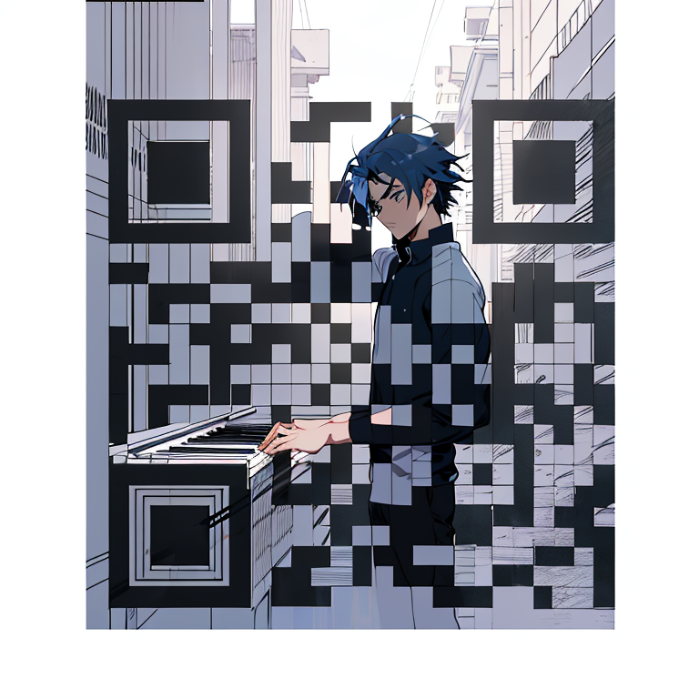
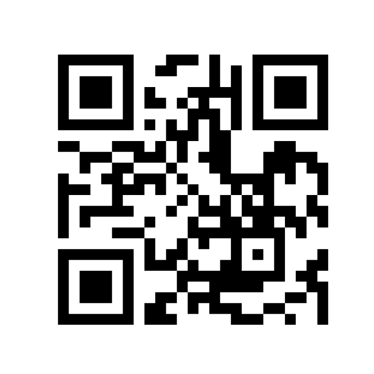
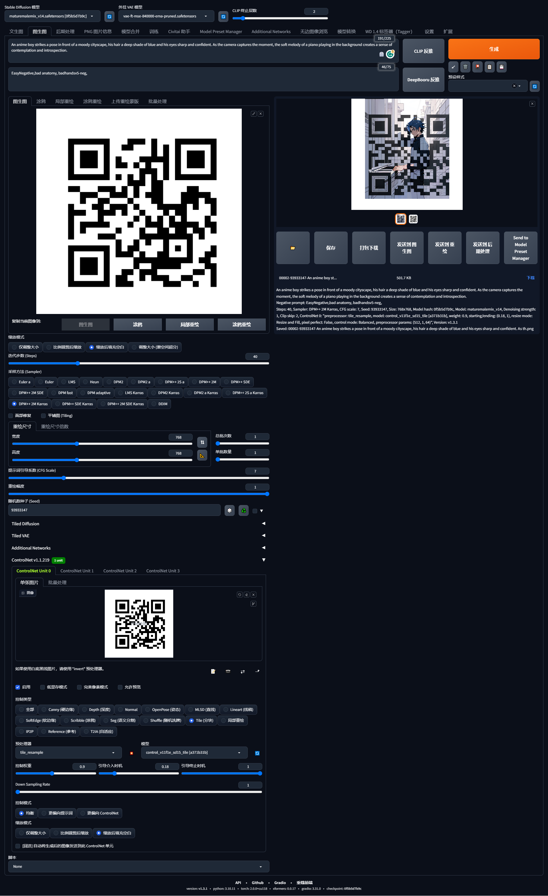

# 01.基于Stable Diffusion的AI重绘二维码制作

时间：2023年6月13日

最近，基于Stable Diffusion的二维码在网络上引起了不小的关注，但是由于没有官方开源的工具，而我又对这个十分感兴趣，因此本文件旨在使用Stable Diffusion的基本使用方法来进行AI二维码的制作。

先放生成结果

以下是操作步骤：

（1）将你的webURL制作为二维码，建议URL不要太长，否则二维码会很复杂，我这里使用的是我的github的页面。

（2）建议将二维码周围扩展一部分空白，这样Stable Diffusion可以在周围进行扩展绘画

（3）安装Stable Diffusion，这里我用的也是[秋叶大佬的整合包](https://space.bilibili.com/12566101)，需要注意将controlNet的模型也下载复制

（4）下载你喜欢的模型和lora等等

我这里使用的是如下模型和参数，未使用lora

https://civitai.com/models/50882/maturemalemix

https://civitai.com/images/850039?modelVersionId=75441&prioritizedUserIds=329560&period=AllTime&sort=Most+Reactions&limit=20

（5）在图生图中，需要将下面的参数进行调整即可绘制

|参数|调整|说明|
|上传二维码|--|必须选项|
|prompt文本|---|必须选项|
|重绘幅度|调整为1|必须选项，这里如果根据prompt自动填写的话有可能不是1，需要改为1|
|controlNet开启|---|必须选项|
|controlNet-Tile (分块)|---|必须选项|
|controlNet-引导介入时机|建议0.15-0.35|必须选项，如果生成的二维码无法扫描，则使用较小的这个值|

